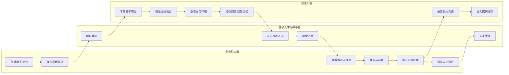

# Showcase｜Codex 项目级 UJ 穿透审计提示词

> 审计对象：`leishi335-cell/leishi335-cell-quantum-talent-showcase`
>
> 审计目标：不是继续做 UI Review，而是站在真实候选人使用视角，对 Showcase 做一次项目级“穿透审计”，确保候选人从进入网站到完成投递这一段 User Journey 不出现断点、假链路、静默失败、状态错配或数据丢失。

---

## 0. 你的角色与工作方式

你现在不是开发新功能，而是作为 **资深 Staff Engineer + AI 产品架构师 + QA/可靠性审计负责人**，对当前 Showcase 仓库进行一次真实业务链路审计。

必须以以下优先级判断事实：

1. 当前 main 分支源码；
2. 当前 Supabase 实际数据结构与约束；
3. 当前 Route/API 真实行为；
4. 当前产品实际页面；
5. README / docs 仅作辅助，若与代码冲突，以代码与数据库为准。

不要只读 README 后给结论，不要只做静态代码风格 review，不要只列“可能有问题”。

你需要沿真实 UJ 逐节点穿透：

**页面 → 组件 → Route/API → Supabase → 数据落库/返回 → 下一节点**。

发现问题时必须给出：

- 触发条件；
- 真实根因；
- 影响范围；
- 严重级别 P0/P1/P2；
- 涉及文件；
- 修复建议；
- 可验证验收 Case。

本轮先审计，不要未经确认直接大规模改代码。

---

# 1. 共同业务 UJ 基线

整个平台要保证下面这条真实业务链路成立：

Showcase 重点负责其中：

**P1 → C1 → C2 → C3 → C4 → P2 → P3**。

你要证明这段链路不是“看起来能用”，而是真的能用。

---

# 2. Showcase 当前产品责任边界

Showcase 是候选人侧公开站，核心职责：

1. 展示量子科技行业与前沿赛道；
2. 展示 Published 岗位；
3. 支持岗位中心 / 急招 / 精选 / 前沿赛道发现；
4. 支持岗位详情；
5. 支持投递与咨询；
6. 将 Lead / Apply 真实写回 Supabase；
7. 保证 Console 后续能够读取和处理这些数据；
8. 不暴露客户真实公司敏感信息与内部字段。

当前 Track 规则：

- `superconducting`｜超导量子
- `ion-trap`｜离子阱
- `photonics`｜光量子
- `communication-sensing`｜量子通信与测量
- `track = null` 合法，仍属于岗位中心，只是不进入四大赛道栏目。

不要重新发明 taxonomy。

---

# 3. 必须穿透审计的候选人主链路

## 3.1 首页 → 岗位发现

逐项验证：

- 首页是否真实读取 Supabase Published 岗位；
- 岗位中心是否包含全部 Published，包括 `track=null`；
- 急招是否只展示“当前有效急招”，而非只看 `urgent=true`；
- 精选是否只看 `featured=true`；
- 前沿赛道筛选是否只使用四大合法 Track；
- 同一岗位同时 urgent + featured + track 是否可以合法出现在多个入口；
- 0 条数据时是否正确 Empty，而非报错或 Mock；
- Supabase 权限/RLS 失败时是否有可识别错误，不会误判为空数据。

重点检查：

- `src/app/page.tsx`
- `src/app/opportunities/**`
- `src/components/sections/**`
- `src/components/job/**`
- `src/hooks/use-public-jobs.ts`
- `src/app/api/public/jobs/**`

---

## 3.2 列表 → 岗位详情

这是近期真实使用已经暴露过问题的重点链路。

必须验证：

- 首页任意岗位点击是否稳定进入详情；
- 岗位中心任意岗位点击是否稳定进入详情；
- 精选、急招、赛道入口进入同一岗位时详情一致；
- URL 使用的 `slug/id` 与 Route 参数是否一致；
- Server Component 是否错误依赖 Client Module；
- Server Component 是否存在 localhost self-fetch / DEPLOY_RUN_PORT 等生产脆弱实现；
- `generateMetadata` 是否可能比页面主体先抛错；
- `track=null` 是否能正常渲染详情；
- 已下架/不存在岗位是否进入 404，而不是 Server Render Error；
- related jobs 是否会因 track 为空、权限异常、字段漂移导致整个详情页崩溃。

重点检查：

- `src/app/jobs/[id]/**`
- `src/app/api/public/jobs/[slug]/**`
- 共享 PublicJob type/helper/server data layer

---

## 3.3 岗位详情 → 投递

逐项验证：

- Apply Drawer/Modal 是否真的提交；
- 姓名、联系方式、简历等字段校验是否一致；
- publication id / slug 是否正确传递；
- API 失败是否提示；
- 成功是否有明确成功状态；
- 快速重复点击是否产生重复 Lead；
- 网络超时/重试是否重复写入；
- 空联系方式、非法邮箱/手机号、超长文本是否被服务端校验；
- 前端校验不能替代服务端校验；
- 失败时不得出现“看起来成功但没落库”的静默失败。

重点检查：

- `src/components/job/apply-drawer*`
- `src/app/api/public/apply/**`
- RPC `public_submit_application`
- Lead 数据映射

---

## 3.4 投递 → Supabase 数据记录

必须明确回答：

一次真实投递后，Supabase 到底写入什么？

至少检查：

- `leads` 是否真实新增；
- publication_id 是否正确；
- site_id/source 是否正确；
- name/contact/resume_url/notes 是否完整；
- created_at 是否正确；
- 是否存在“RPC 成功但数据未落”的可能；
- RPC SECURITY DEFINER 是否只开放必要能力；
- anon 是否可以越权写其他表；
- 是否可能通过客户端构造参数篡改内部字段；
- 对已 Offline/Archived Publication 是否仍可提交；
- 对不存在 Publication 是否正确失败。

---

# 4. 跨系统契约审计

Showcase 不应只审自己的页面，要审它和 Console / Supabase 的边界契约。

必须回答：

1. Showcase 产生的 Lead，Console 当前能否读取？
2. Showcase 写入字段名、类型、枚举是否与 Console Repository/Service 对得上？
3. Publication status/track/urgent/featured 在两边含义是否一致？
4. Showcase 是否还有一套重复 Public API 实现与 Console 产生漂移风险？
5. 如果两边都有 `/api/public/*`，当前线上到底谁是事实入口？
6. 是否存在“列表 API 一套 DTO，详情 API 一套 DTO，Apply 又一套 DTO”的数据契约漂移？
7. 是否应抽出单一 PublicJob DTO/mapper 作为事实源？

必须给出具体代码证据。

---

# 5. 数据安全与隐私审计

这是公开候选人站，必须重点确认：

- Public API 不 JOIN / 泄露 `companies` 内部数据；
- 不暴露客户真实公司名（除非 Publication 明确允许公开）；
- 不暴露 internal_notes / source_file / hard_requirements / priority / owner / internal salary 等内部字段；
- Error Response 不暴露 Supabase 原始错误、SQL、key、内部 URL；
- Publishable/anon key 使用正确；
- service role key 不得进入浏览器 bundle；
- RLS/GRANT 只允许读取 `status='published'`；
- Offline/Archived 无法通过猜 slug 读取；
- Apply RPC 不允许写入 arbitrary publication / internal columns。

---

# 6. 失败态 / 边界态 / 幂等审计

不要只测 Happy Path，至少覆盖：

- Supabase 暂时不可用；
- anon SELECT 权限缺失；
- API 500；
- API 404；
- API 返回空数组；
- 某个字段为 null；
- `track=null`；
- `urgent=true` 但已过期；
- Featured 0 条；
- 急招 0 条；
- Publication 刚下架时用户仍停留在详情页；
- 用户重复提交；
- 用户刷新成功页；
- 用户浏览器慢网/断网；
- 非法 slug；
- tags/responsibilities/requirements 数据格式异常。

必须说明每种情况当前表现和理想表现。

---

# 7. 代码架构健康度

围绕这条 UJ 审计，不要泛泛谈架构。

重点看：

- Server / Client Boundary；
- Route Handler 与 Server Component 的数据获取边界；
- 是否存在 self-fetch；
- DTO 是否重复；
- mapper/parser 是否重复；
- 错误语义是否统一；
- loading/error/empty 是否统一；
- analytics 是否影响主流程；
- 是否存在 Mock/静态 fallback 掩盖真实数据问题；
- docs 与代码是否严重漂移。

---

# 8. 必须完成的真实 UAT Case

请至少设计并尽可能执行以下 UAT：

### UAT-S1
Published + track=null 普通岗位

首页岗位中心可见 → 进入详情 → 投递成功 → Lead 落库。

### UAT-S2
Published + superconducting

岗位中心可见 + 前沿赛道可见 → 两个入口进入同一详情。

### UAT-S3
Published + featured=true

精选可见 → 详情正常 → 投递成功。

### UAT-S4
Published + urgent=true + expires_at>now

急招可见 + Badge 正常 → 详情正常。

### UAT-S5
Published + urgent=true + expires_at<now

岗位中心仍可见；急招区不可见；详情无急招 Badge。

### UAT-S6
Offline/Archived

所有公开入口不可见；直接访问旧 slug 不得泄露详情。

### UAT-S7
重复投递同一岗位

明确当前产品允许/不允许重复，并验证数据库真实行为。

### UAT-S8
Supabase/API 故障

页面出现正确 Error，而不是假 Empty/白屏/Server Component 崩溃。

---

# 9. 最终输出格式

不要输出一篇泛泛的代码 Review。

请按以下结构：

## A. 执行摘要

一句话判断：

- UJ 是否真正闭环；
- 当前是否适合继续真实使用；
- 最大风险是什么。

## B. UJ 链路状态表

| 节点 | 状态 | 真实实现 | 风险 | 证据 |
|---|---|---|---|---|
| 岗位展示 | ✅/⚠️/❌ | ... | ... | 文件/函数 |
| 岗位详情 | | | | |
| 投递入口 | | | | |
| Lead 落库 | | | | |
| Console 可消费 | | | | |

## C. 问题清单

按：

- P0：阻断真实业务 / 数据丢失 / 安全泄露
- P1：高概率导致错误业务结果
- P2：体验/维护性问题

每条必须包含：

- 根因
- 触发路径
- 文件
- 修复建议
- 验收 Case

## D. 数据契约图

明确：

`JobPublication → PublicJob DTO → Job Detail → Apply Request → Lead`

每一步关键字段映射。

## E. 修复优先级

给出：

**先修什么 → 再修什么 → 最后修什么**。

## F. 回归测试清单

给出可逐条勾选的真实 UAT Checklist。

---

# 10. 审计底线

不要因为页面“能打开”就判定通过。

真正通过的标准是：

> 候选人能稳定发现真实岗位 → 稳定进入真实详情 → 稳定提交真实投递 → Supabase 确实落库 → Console 后续确实可消费，而且任何异常场景都不会产生错误业务数据、静默丢失或敏感信息泄漏。
